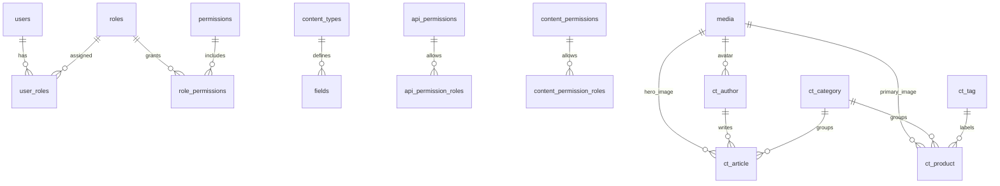

# ApiForge Headless CMS (Spring) - Technical Documentation

## Table of Contents
1. Overview
2. Architecture
3. Tools and Libraries
4. API Flows
5. Core Code Walkthrough
6. Database Schema and Diagram

---

## 1. Overview
ApiForge is a Spring Boot-based headless CMS built as a small set of microservices behind a Spring Cloud Gateway. It focuses on:
- schema-driven content types (dynamic tables per content type)
- JWT authentication
- media uploads
- role- and permission-centric access control (stored in DB, enforced primarily at the gateway by JWT validation)

Key runtime processes:
- The API Gateway authenticates requests and forwards them to internal services.
- The Auth Service manages users, roles, and JWT issuance.
- The Content Type Service defines content schemas and creates dynamic DB tables.
- The Content Service performs CRUD on dynamic content tables.
- The Media Service stores files and metadata.
- The Permission Service stores API and content permissions for role-based access.

---

## 2. Architecture

### 2.1 Service Inventory and Ports
All services use the same PostgreSQL database configured via shared properties. Default local ports:

- API Gateway: `8080` (inferred from Postman collection base URL)
- Auth Service: `8081` (`auth-service/src/main/resources/application.yml`)
- Content Type Service: `8082` (`content-type-service/src/main/resources/application.yml`)
- Content Service: `8083` (`content-service/src/main/resources/application.yml`)
- Media Service: `8084` (`media-service/src/main/resources/application.yml`)
- Permission Service: `8085` (`permission-service/src/main/resources/application.yml`)

### 2.2 High-Level Request Flow
1. Client calls the API Gateway at `http://localhost:8080/...`.
2. `AuthenticationFilter` in the gateway validates JWT and enriches headers with user claims.
3. Gateway routes traffic to the target service based on path prefix.
4. Service handles request and persists data in PostgreSQL.

### 2.3 Gateway Routing
`api-gateway/src/main/java/com/apiforge/api_gateway/config/GatewayConfig.java`
- `/api/auth/**` -> `auth-service:8081` (no JWT check on login/register)
- `/api/content-types/**` -> `content-type-service:8082` (JWT required)
- `/api/content/**` -> `content-service:8083` (JWT required)
- `/api/media/**` -> `media-service:8084` (JWT required, but service allows public file reads)
- `/api/permissions/**` -> `permission-service:8085` (JWT required)

### 2.4 Authentication and Propagation
`api-gateway/src/main/java/com/apiforge/api_gateway/filter/AuthenticationFilter.java`
- Validates JWT with `JwtUtil` from `common`.
- Injects identity into headers:
  - `X-User-Id`
  - `X-Username`
  - `X-User-Roles`

Downstream services currently allow all traffic (their `SecurityConfig` classes `permitAll()`), and they rely on the gateway to enforce authentication.

### 2.5 Data Ownership
- **Auth Service** owns `users`, `roles`, `permissions`, and relationship tables.
- **Content Type Service** owns `content_types` and `fields`, and creates dynamic tables like `ct_author` based on schemas.
- **Content Service** stores entries in dynamic tables (`ct_{apiId}`).
- **Media Service** stores `media` metadata and uploads to the filesystem.
- **Permission Service** stores `content_permissions` and `api_permissions` with role mappings.

### 2.6 Error Handling
`common/src/main/java/com/apiforge/common/exception/GlobalExceptionHandler.java`
- Normalizes exception handling into `ApiResponse` with proper HTTP status codes.
- Applies to all services that include the `common` module.

---

## 3. Tools and Libraries

### 3.1 Build and Runtime
- Java 25 (`pom.xml` properties)
- Maven (wrapper scripts `mvnw`, `mvnw.cmd`)
- Spring Boot 3.5.8
- Spring Cloud 2025.0.1 (Gateway)

### 3.2 Frameworks and Modules
- Spring Web (REST services)
- Spring WebFlux (used by `ContentTypeClientService` for `WebClient`)
- Spring Security (stateless configurations in each service)
- Spring Data JPA (entity persistence)

### 3.3 Database and Auth
- PostgreSQL
- jjwt 0.12.6 for JWT creation/validation
- BCrypt password hashing (`auth-service`)

### 3.4 Developer Tools and Conventions
- Lombok (model builders and getters/setters)
- Postman collection: `apiforge.json`
- `run-all.sh` helper to build and run all services

---

## 4. API Flows

### 4.1 Authentication Flow
Source: `auth-service/src/main/java/com/apiforge/auth/controller/AuthController.java`

1. Register
   - `POST /api/auth/register`
   - `AuthService.register` creates user and assigns `REGISTERED` role by default.
2. Login
   - `POST /api/auth/login`
   - Returns JWT access token + refresh token.
3. Validate
   - `POST /api/auth/validate`
   - Checks if JWT is valid and not expired.
4. Refresh
   - `POST /api/auth/refresh`
   - Exchanges refresh token for a new access token.

### 4.2 Content Type Creation Flow (Schema-First)
Source: `content-type-service/src/main/java/com/apiforge/contenttype/service/ContentTypeService.java`

1. `POST /api/content-types`
2. Service persists `content_types` and `fields`.
3. `DynamicTableService.createTableForContentType` generates a new `ct_{apiId}` table.
4. Fields map to SQL column types using `FieldType`.

### 4.3 Content CRUD Flow (Dynamic Tables)
Source: `content-service/src/main/java/com/apiforge/content/controller/ContentController.java`

1. Client calls `POST /api/content/{apiId}` with arbitrary fields.
2. Content Service verifies the content type exists by calling Content Type Service.
3. `DynamicContentRepository` constructs SQL dynamically based on the input map.
4. CRUD operations occur on table `ct_{apiId}`.

Important detail: SQL values are parameterized, but the table name is string concatenated. The table name comes from validated content types, not raw input.

### 4.4 Media Upload and Retrieval
Source: `media-service/src/main/java/com/apiforge/media/controller/MediaController.java`

- Upload: `POST /api/upload` with `files` multipart field.
- Stored on filesystem at `./uploads` and metadata saved to `media` table.
- Public read: `GET /api/upload/files/{fileName}` (bypasses JWT at gateway + service).

### 4.5 Permissions Definition Flow
Source: `permission-service/src/main/java/com/apiforge/permission/controller/PermissionController.java`

Two permission models:
- **API Permissions**: (endpoint + method)
- **Content Permissions**: (content type + CRUD action)

Example:
- `POST /api/permissions/content` -> allows roles to read/write a content type.
- `POST /api/permissions/api/check` -> validates access for API endpoints.

Note: These permissions are stored and exposed but are not directly enforced in the content service code. Enforcement is expected to be handled by gateway + application logic.

### 4.6 End-to-End Example (Postman Collection)
See `apiforge.json` for the recommended demo flow:
1. Register + Login
2. Upload media
3. Create content types
4. Assign permissions
5. Create content entries

---

## 5. Core Code Walkthrough

### 5.1 API Gateway
`api-gateway/src/main/java/com/apiforge/api_gateway/filter/AuthenticationFilter.java`
- Validates JWT from `Authorization: Bearer <token>` header.
- Adds `X-User-Id`, `X-Username`, `X-User-Roles` to downstream requests.
- Allows public access to login/register and media file endpoints.

`api-gateway/src/main/java/com/apiforge/api_gateway/config/GatewayConfig.java`
- Defines all route mappings and applies the auth filter to non-auth endpoints.

### 5.2 Auth Service
`auth-service/src/main/java/com/apiforge/auth/service/AuthService.java`
- Register flow assigns default `REGISTERED` role (creates it if missing).
- Passwords are hashed with BCrypt.
- JWT and refresh tokens generated via `JwtService`.

`common/src/main/java/com/apiforge/common/util/JwtUtil.java`
- Signs and validates JWTs using HS256 and configurable secrets.
- Supports a separate refresh token with a different signing key.

### 5.3 Content Type Service
`content-type-service/src/main/java/com/apiforge/contenttype/service/ContentTypeService.java`
- Saves content type metadata and fields in PostgreSQL.
- Calls `DynamicTableService` to create a new dynamic table.
- Updates to schema are simplified and do not include full migrations.

`content-type-service/src/main/java/com/apiforge/contenttype/service/DynamicTableService.java`
- Maps `FieldType` enums to SQL types.
- Creates, drops, or alters columns using `JdbcTemplate`.

### 5.4 Content Service
`content-service/src/main/java/com/apiforge/content/service/ContentService.java`
- Validates existence of content type via `ContentTypeClientService`.
- Executes CRUD operations on `ct_{apiId}` tables.

`content-service/src/main/java/com/apiforge/content/repository/DynamicContentRepository.java`
- Constructs SQL INSERT/UPDATE/SELECT queries dynamically based on request payloads.

### 5.5 Media Service
`media-service/src/main/java/com/apiforge/media/service/MediaService.java`
- Writes files to local filesystem in `./uploads`.
- Ensures unique names for display while storing by UUID hash.

`media-service/src/main/java/com/apiforge/media/controller/MediaController.java`
- Serves files and sets download headers based on stored metadata.

### 5.6 Permission Service
`permission-service/src/main/java/com/apiforge/permission/service/PermissionService.java`
- Stores API and content permissions with allowed roles.
- Provides `checkApiPermission` and `checkContentPermission` utilities.

### 5.7 Common Response and Error Model
`common/src/main/java/com/apiforge/common/dto/ApiResponse.java`
- Standard response envelope: `success`, `message`, `data`, `error`.

`common/src/main/java/com/apiforge/common/exception/GlobalExceptionHandler.java`
- Consolidates error handling into consistent API responses.

---

## 6. Database Schema and Diagram

### 6.1 Connection Configuration
Shared config lives in the `common` module:

- Host: `localhost`
- DB Name: `devdb`
- Username: `dev`
- Password: `devpass`
- JDBC URL template (services):
  `jdbc:postgresql://${apiforge.datasource.host}/${apiforge.datasource.db-name}?${apiforge.datasource.params}`
- Params: `sslmode=require&channelBinding=require`

Sources:
- `common/src/main/resources/common-application.yml`
- `common/src/main/resources/common-application-dev.yml`
- `auth-service/src/main/resources/application.yml`

### 6.2 Core Tables
Defined in `db/00_ddl.sql`:

- `users` (auth identities)
- `roles`
- `permissions`
- `user_roles` (many-to-many)
- `role_permissions` (many-to-many)
- `content_types` (schema metadata)
- `fields` (schema fields)
- `media` (file metadata)
- `api_permissions` + `api_permission_roles`
- `content_permissions` + `content_permission_roles`

### 6.3 Dynamic Content Tables
Also in `db/00_ddl.sql` (seed examples):

- `ct_author`
- `ct_category`
- `ct_tag`
- `ct_article`
- `ct_product`

The Content Type Service can create additional tables dynamically at runtime with the naming convention `ct_{apiId}`.

### 6.4 Entity Relationships
- `users` <-> `roles` via `user_roles`
- `roles` <-> `permissions` via `role_permissions`
- `content_types` -> `fields`
- `api_permissions` -> `api_permission_roles`
- `content_permissions` -> `content_permission_roles`
- Dynamic tables reference other entities only by ID (no enforced foreign keys in DDL for content tables).

### 6.5 Mermaid ER Diagram



### 6.6 Seed Data Overview
Seed scripts in `db/` populate demo data:
- `01_seed_auth.sql`: users, roles, permissions
- `02_seed_media.sql`: media records
- `03_seed_content_types.sql`: content types and fields
- `04_seed_dynamic_content.sql`: content entries
- `05_seed_permissions.sql`: role-based access rules

### 6.7 Sequence Reset
`db/99_reset_sequences.sql` resets ID sequences for core and dynamic tables after seeding.

---

## 7. Service Startup
Use the helper script at project root:

```bash
./run-all.sh
```

This builds and launches all services in the correct order and writes logs to `.run/logs/`.

---

## 8. Notes and Limitations
- Content type updates do not perform full schema migrations. The update flow replaces field metadata but does not alter existing DB tables.
- Content service does not validate data types against schema fields beyond existence checks.
- Permission rules are stored but not enforced in content operations unless additional checks are added.

---

## 9. Reference Paths
- API Gateway: `api-gateway/src/main/java/com/apiforge/api_gateway/`
- Auth Service: `auth-service/src/main/java/com/apiforge/auth/`
- Content Type Service: `content-type-service/src/main/java/com/apiforge/contenttype/`
- Content Service: `content-service/src/main/java/com/apiforge/content/`
- Media Service: `media-service/src/main/java/com/apiforge/media/`
- Permission Service: `permission-service/src/main/java/com/apiforge/permission/`
- DB SQL: `db/`
- Postman collection: `apiforge.json`

---

# Part 1 - Developer Onboarding Deep Dive (Gateway, Common, Auth)

## 10. Developer Onboarding Guide (Context, Assumptions, and How to Read This Doc)

This documentation is intentionally long-form and module-centered to accelerate onboarding. It assumes the reader is a backend developer familiar with Java and Spring Boot but new to this codebase. Every module is explained with:
- its role in the system
- core classes and their responsibilities
- execution flow (what calls what)
- data structures and how they map to the database

A suggested reading path is:
1. This onboarding section (the “map” of how to work in the repo)
2. Common module (shared DTOs, exceptions, and JWT)
3. API Gateway (request entry point)
4. Auth Service (users, roles, login)
5. Content Type Service (schema and dynamic tables)
6. Content Service (CRUD on dynamic tables)
7. Media Service (file handling)
8. Permission Service (permissions storage)
9. Database schema (entities + relations)

This Part 1 covers onboarding foundations, Common, Gateway, and Auth. Parts 2–3 will cover remaining modules and deep-dive into the DB, code paths, and extension points.

### 10.1 Project Structure at a Glance
Top-level directories:
- `api-gateway/`: Spring Cloud Gateway. All external API calls go through it.
- `auth-service/`: user management, authentication, JWT issuance.
- `content-type-service/`: schema metadata and dynamic table creation.
- `content-service/`: CRUD operations on content data tables.
- `media-service/`: file uploads and metadata storage.
- `permission-service/`: permissions for content and API endpoints.
- `common/`: shared DTOs, exceptions, and JWT utilities.
- `db/`: DDL and seed SQL scripts.

These modules are assembled via the root `pom.xml` and are run together using `run-all.sh`.

### 10.2 Local Runtime Context
All services share a PostgreSQL database defined in `common` config. The credentials are in repo config files and are used by all services in dev profile. Any developer should confirm that the configured database is reachable, otherwise some endpoints will fail at runtime.

Services default to `dev` profile (see application.yml per module). The content-service calls content-type-service by URL `http://localhost:8082` (see `content-service/src/main/resources/application.yml`). This means you must run content-type-service if you want content CRUD to work.

### 10.3 Build and Run
Use `run-all.sh` to build and start all services.

```bash
./run-all.sh
```

The script runs `mvn -pl <services> -am clean package` and then starts each module using `spring-boot:run`. Logs are written to `.run/logs/`. If you want to run a single module, you can use:

```bash
./mvnw -pl auth-service spring-boot:run
```

### 10.4 Debug Strategy
Recommended approach for onboarding:
1. Start the full stack (`run-all.sh`).
2. Use the Postman collection (`apiforge.json`) to exercise flows.
3. For a specific issue, isolate the relevant service and run it alone.
4. Use logs in `.run/logs/` to inspect behavior per service.

---

## 11. Common Module (Shared Building Blocks)
The `common` module is the backbone that provides shared primitives for all services. It is intentionally small but critical for response consistency and security.

### 11.1 Purpose and Scope
The `common` module includes:
- `ApiResponse` wrapper for consistent HTTP response structure
- Custom exception classes and a global exception handler
- JWT utilities used in both the gateway and auth service

Every service depends on this module for error consistency and token handling.

### 11.2 ApiResponse (Response Envelope)
File: `common/src/main/java/com/apiforge/common/dto/ApiResponse.java`

This class standardizes API responses to the following JSON shape:

```json
{
  "success": true,
  "message": "optional human-readable summary",
  "data": { ...payload... },
  "error": null
}
```

Core design choices:
- The envelope always contains `success` and either `data` or `error`.
- Consumers can rely on a consistent layout for all service responses.
- `message` is optional and is used for actions like “Content created successfully.”

This is used across all controllers in every module. For example, `AuthController.register` returns `ApiResponse.success("User registered successfully", response)`.

### 11.3 Custom Exceptions
File: `common/src/main/java/com/apiforge/common/exception/CustomExceptions.java`

Contains a set of lightweight RuntimeExceptions:
- `ResourceNotFoundException`
- `UnauthorizedException`
- `BadRequestException`
- `ForbiddenException`
- `ConflictException`

These are thrown from service layers to indicate errors without coupling to Spring’s response objects.

### 11.4 GlobalExceptionHandler
File: `common/src/main/java/com/apiforge/common/exception/GlobalExceptionHandler.java`

This is the unified error handler for all services that include the `common` module.
It maps each custom exception to an HTTP status code and wraps the response in `ApiResponse.error(...)`. For example:
- `ResourceNotFoundException` -> 404
- `UnauthorizedException` -> 401
- `ForbiddenException` -> 403

This ensures consistent API behavior and minimizes boilerplate in controllers.

### 11.5 JwtUtil
File: `common/src/main/java/com/apiforge/common/util/JwtUtil.java`

This is the most critical part of `common`. It provides:
- JWT generation for access tokens
- JWT generation for refresh tokens
- Validation and extraction of claims

#### Token Generation
`generateToken(username, userId, roles)` creates a signed JWT with:
- `sub` (subject) = username
- `userId` claim
- `roles` claim
- `iat` and `exp`

`generateRefreshToken` mirrors this but:
- uses a different signing secret
- sets `tokenType=refresh` claim

#### Token Validation
`validateToken` checks expiration only and catches exceptions broadly.
`validateRefreshToken` checks both expiration and tokenType.

#### Claims Extraction
The class supports extraction of:
- username
- userId
- roles

#### Secrets and Configuration
The keys and expiration values are injected via Spring property placeholders. The defaults are defined in `auth-service/src/main/resources/application.yml`:

```yaml
jwt:
  secret: apiforge-headless-cms-secret-key-minimum-256-bits-required-for-hs256
  expiration: 3600000
  refresh-secret: apiforge-headless-cms-refresh-secret-key-minimum-256-bits-required
  refresh-expiration: 604800000
```

Because JWT is consumed by both gateway and auth service, the secrets must match across services.

### 11.6 How to Extend the Common Module
- Add new shared DTOs when multiple services need to exchange typed payloads.
- Add shared validation utilities or constants if multiple modules should enforce the same logic.
- Avoid adding service-specific dependencies to keep the common module lightweight.

---

## 12. API Gateway Module (Entry Point)
The API Gateway is the first hop for external requests. It is responsible for:
- routing to the correct microservice
- validating JWT tokens
- injecting user identity headers for downstream services

### 12.1 Primary Responsibilities
- Accept all traffic under `/api/*`.
- Route based on path prefix (auth, content, media, permissions).
- Validate JWT for protected endpoints.
- Allow public access to login/register and public file retrieval.

### 12.2 Route Configuration
File: `api-gateway/src/main/java/com/apiforge/api_gateway/config/GatewayConfig.java`

Routes are declared explicitly:
- `/api/auth/**` -> `http://localhost:8081`
- `/api/content-types/**` -> `http://localhost:8082`
- `/api/content/**` -> `http://localhost:8083`
- `/api/media/**` -> `http://localhost:8084`
- `/api/permissions/**` -> `http://localhost:8085`

Routes other than `/api/auth/**` and public media file paths apply `AuthenticationFilter`.

### 12.3 Authentication Filter
File: `api-gateway/src/main/java/com/apiforge/api_gateway/filter/AuthenticationFilter.java`

The filter’s logic is simple but central:
1. Check if request path is a public auth endpoint or file endpoint.
2. If public, skip JWT validation.
3. Otherwise check for `Authorization` header and validate JWT.
4. Extract claims and propagate them downstream as headers.

#### Public Endpoints
`isAuthEndpoint` checks for:
- `/api/auth/login`
- `/api/auth/register`
- `/api/auth/validate`
- `/api/media/files` (public file access)

Everything else requires a Bearer token.

#### Claim Propagation
After a token is validated:
- `X-User-Id` is set with the numeric ID
- `X-Username` is set with the username
- `X-User-Roles` is set with a comma-separated list of roles

These headers are available to downstream services. Currently, they are not enforced in content service itself, but they enable a future authorization layer.

### 12.4 Why Gateway Handles Authentication
Every downstream service has a permissive security configuration (all requests permitted). This is intentional: the gateway is the enforcement point. This pattern:
- centralizes JWT validation
- removes duplicate security logic
- reduces boilerplate in each module

However, it comes with an assumption: all requests must go through the gateway. If a developer hits a service directly, they bypass authentication and authorization.

### 12.5 Local Testing Behavior
If you bypass the gateway and call services directly (e.g., `localhost:8083`), no JWT validation occurs because the services are configured with `.permitAll()`. This is important in local testing and is also a security risk if services are exposed directly in production.

### 12.6 Extending the Gateway
Common extensions include:
- adding new routes for additional services
- applying custom filters (rate limiting, logging, CORS)
- enforcing permission checks at the gateway based on role claims

Because the gateway depends on `common`, you can reuse `JwtUtil` to validate or parse tokens.

---

## 13. Auth Service Module (Users, Roles, Tokens)
The Auth Service handles user registration, login, role assignments, and JWT issuance. It owns the canonical identity tables in the database.

### 13.1 Key Data Models
Located in `auth-service/src/main/java/com/apiforge/auth/model/`.

- `User`: fields map to `users` table. Includes username, email, password hash, enabled status, and roles.
- `Role`: maps to `roles` table. Includes name and description.
- `Permission`: maps to `permissions` table.

The User model includes a many-to-many relation with Role (through `user_roles`).

### 13.2 Repositories
Located in `auth-service/src/main/java/com/apiforge/auth/repository/`.

- `UserRepository`: queries users by username/email, supports existence checks.
- `RoleRepository`: used to fetch roles by name (e.g., `REGISTERED`).
- `PermissionRepository`: for CRUD of permissions.

All repositories extend Spring Data JPA interfaces and are used by service classes.

### 13.3 AuthController Endpoints
File: `auth-service/src/main/java/com/apiforge/auth/controller/AuthController.java`

Endpoints:
- `POST /api/auth/register`
- `POST /api/auth/login`
- `POST /api/auth/validate`
- `POST /api/auth/refresh`
- `GET /api/auth/users`
- `GET /api/auth/users/{id}`
- `PUT /api/auth/users/{id}/roles`
- `DELETE /api/auth/users/{id}`

This controller delegates to service classes and returns `ApiResponse` objects.

### 13.4 AuthService (Registration and Login)
File: `auth-service/src/main/java/com/apiforge/auth/service/AuthService.java`

#### Registration Flow
1. Check for existing username and email.
2. If not exists, load or create the `REGISTERED` role.
3. Hash password with BCrypt.
4. Persist user with default role.
5. Issue access + refresh tokens via `JwtService`.

Design notes:
- `REGISTERED` role is created on the fly if it is missing. This removes the need for an explicit role seed in DB, but seed scripts already include it.
- The service uses a Set of roles to avoid duplicates.

#### Login Flow
1. Accept username or email.
2. Lookup user by username, then by email if missing.
3. Check password with BCrypt.
4. Ensure user is enabled.
5. Generate access + refresh tokens.

The login flow allows authentication by either username or email, and uses the same `AuthResponse` DTO as registration.

#### Token Validation and Refresh
- `validateToken` simply delegates to `JwtService`.
- `refresh` validates a refresh token and issues a new access + refresh token.

Refresh tokens are rejected if expired, missing tokenType, or not valid.

### 13.5 UserService (User Admin Functions)
File: `auth-service/src/main/java/com/apiforge/auth/service/UserService.java`

Provides:
- list users
- get user by ID
- assign roles
- delete user

The `assignRolesToUser` method ensures every role exists, otherwise throws `ResourceNotFoundException`.

### 13.6 Security Configuration
File: `auth-service/src/main/java/com/apiforge/auth/config/SecurityConfig.java`

The auth-service config is intentionally permissive:
- `csrf` disabled
- all requests permitted
- stateless sessions

This aligns with the gateway-based security model.

### 13.7 DTOs and Contract Shapes
Key DTOs under `auth-service/src/main/java/com/apiforge/auth/dto/`:
- `RegisterRequest`: username, email, password, firstname, lastname
- `LoginRequest`: username, password (or email)
- `AuthResponse`: token, refreshToken, userId, username, email, roles
- `UserDto`: safe user projection used in admin endpoints
- `RefreshRequest`: refreshToken

These DTOs form the external API contract for auth.

### 13.8 Token Scope and Lifetime
Tokens are signed with HS256 using configured secrets and expiration values. Because both gateway and auth-service use `JwtUtil`, the JWT configuration must remain consistent between the services. If you change the secret in auth-service, update the gateway environment as well.

### 13.9 Seed Data and Bootstrap
The `db/01_seed_auth.sql` file seeds:
- roles (SUPER_ADMIN, ADMIN, MODERATOR, REGISTERED)
- permissions (MANAGE_USERS, MANAGE_CONTENT, etc.)
- role_permissions mappings
- demo users with bcrypt-encrypted passwords
- user_roles mappings

This is useful for local testing. The app can also create a default role on the fly during user registration if the DB is empty.

### 13.10 Extension Points for Auth
Common tasks for developers:
- Add new roles: update seed script + optional API endpoint.
- Add permission checks: integrate permission-service or a new check in gateway.
- Add password reset: create new endpoint in `AuthController` and extend `UserService`.
- Integrate OAuth: add new providers and issue JWTs in the same response envelope.

---

## 14. Gateway + Auth Combined Flow Example
This section traces an end-to-end authentication request.

### 14.1 Register
Request:
- `POST /api/auth/register` (through gateway)

Gateway steps:
1. `AuthenticationFilter` checks path, sees `/api/auth/register`, skips auth.
2. Routes to `auth-service`.

Auth service steps:
1. `AuthController.register` -> `AuthService.register`.
2. Create user, hash password, assign REGISTERED role.
3. Return `AuthResponse` containing tokens.

### 14.2 Login
Request:
- `POST /api/auth/login`

Gateway steps:
- Skips auth based on public endpoints.

Auth steps:
- Validate credentials and issue tokens.

### 14.3 Authenticated Request
Request:
- `GET /api/content-types`

Gateway steps:
1. Authenticate JWT.
2. Add `X-User-Id`, `X-Username`, `X-User-Roles` headers.
3. Route to `content-type-service`.

Content-type service steps:
- All requests permitted at Spring Security level, so processing continues to controller.

This model emphasizes gateway as the enforcement boundary.

---

## 15. Developer Notes for Part 1

### 15.1 Operational Caveats
- The gateway is a hard dependency; direct service access bypasses authentication.
- JWT validation is centralized at the gateway. Tokens are not revalidated in each service.
- Refresh tokens are separate and require the refresh secret to be consistent.

### 15.2 Debugging Checklist
If auth isn’t working:
1. Check JWT secrets in `auth-service/src/main/resources/application.yml`.
2. Check `common` module is on the gateway classpath (it is in `api-gateway/pom.xml`).
3. Ensure requests include `Authorization: Bearer <token>`.
4. Confirm gateway routes (paths must match those in `GatewayConfig`).

### 15.3 What to Expect Next
Part 2 will cover:
- Content Type Service deep dive (dynamic schema and table creation)
- Content Service deep dive (dynamic CRUD)
- Media Service deep dive
- Permission Service deep dive

Part 3 will cover:
- Database schema (full explanation)
- Example data and end-to-end flow walkthroughs
- Extension patterns and best practices


---

# Part 2 - Content Type, Content, Media, Permission (Deep Dive)

This part expands on the modules that make ApiForge a schema-driven CMS. It puts extra emphasis on dynamic content types and dynamic table generation, as requested.

---

## 16. Content Type Service (Schema Definition and Dynamic Tables)
The content-type-service is the heart of the “headless CMS” functionality. It stores metadata describing content types and generates a physical PostgreSQL table per type.

### 16.1 Core Responsibility Summary
- Accept schema definitions via REST API (`/api/content-types`).
- Persist schema metadata in `content_types` and `fields` tables.
- Dynamically create, drop, or alter SQL tables using JDBC.

This module is responsible for translating a high-level schema definition into a PostgreSQL table that can store content entries.

### 16.2 Data Models
Files:
- `content-type-service/src/main/java/com/apiforge/contenttype/model/ContentType.java`
- `content-type-service/src/main/java/com/apiforge/contenttype/model/Field.java`
- `content-type-service/src/main/java/com/apiforge/contenttype/model/FieldType.java`

#### ContentType
Key attributes (mapped to `content_types` table):
- `id`: primary key
- `name`: display name (e.g., "Article")
- `pluralName`: used for UI or list naming
- `apiId`: API identifier (e.g., "articles")
- `description`: optional descriptive text
- `fields`: list of Field entities

#### Field
Mapped to `fields` table, each row defines a column for a content type:
- `name`: human-friendly label
- `fieldName`: column name in DB (snake_case recommended)
- `type`: one of the enum values in `FieldType`
- `required`: boolean
- `unique`: boolean
- `targetContentType`: for relations
- `relationType`: such as MANY_TO_ONE

#### FieldType
Enum in `FieldType.java`:
- SHORT_TEXT
- LONG_TEXT
- RICH_TEXT
- NUMBER
- BOOLEAN
- DATETIME
- MEDIA
- RELATION

These values are mapped to SQL types by `DynamicTableService`.

### 16.3 Controller Endpoints
File: `content-type-service/src/main/java/com/apiforge/contenttype/controller/ContentTypeController.java`

Endpoints:
- `POST /api/content-types` -> create content type and table
- `GET /api/content-types` -> list all types
- `GET /api/content-types/{id}` -> fetch by ID
- `GET /api/content-types/api-id/{apiId}` -> fetch by API ID
- `PUT /api/content-types/{id}` -> update metadata and fields
- `DELETE /api/content-types/{id}` -> delete type and drop table

### 16.4 ContentTypeService (Business Logic)
File: `content-type-service/src/main/java/com/apiforge/contenttype/service/ContentTypeService.java`

The flow for create is:
1. Validate API ID uniqueness.
2. Create and persist a `ContentType` entity.
3. Convert incoming fields into `Field` entities and attach to content type.
4. Save to database via `ContentTypeRepository`.
5. Call `DynamicTableService.createTableForContentType` to create a new physical table.

The table name is derived from the API ID with prefix `ct_`.
Example: `apiId = "article"` -> table name `ct_article`.

#### Update Flow
Update is intentionally simplified:
- Updates the metadata and fields in `content_types` / `fields` tables.
- Does not automatically migrate the physical table to match updated fields.

This is a known limitation. A full solution would include schema diffing and migrations, which is often complex.

#### Delete Flow
When a content type is deleted:
- The dynamic table (`ct_{apiId}`) is dropped via `DynamicTableService`.
- Metadata rows are removed from `content_types` and `fields`.

### 16.5 DynamicTableService (SQL Generation Engine)
File: `content-type-service/src/main/java/com/apiforge/contenttype/service/DynamicTableService.java`

This class is the core of dynamic schema creation. It uses `JdbcTemplate` to execute raw SQL statements.

#### createTableForContentType
This method builds a SQL statement like:

```sql
CREATE TABLE IF NOT EXISTS ct_article (
  id BIGSERIAL PRIMARY KEY,
  created_at TIMESTAMP DEFAULT CURRENT_TIMESTAMP,
  updated_at TIMESTAMP DEFAULT CURRENT_TIMESTAMP,
  title VARCHAR(255) NOT NULL,
  body TEXT,
  author_id BIGINT
)
```

Key details:
- Every content table gets `id`, `created_at`, and `updated_at` columns.
- Each field becomes a column with type based on `FieldType`.
- `required = true` results in `NOT NULL` constraints.
- `unique = true` results in `UNIQUE` constraints.

#### Mapping Field Types to SQL
`mapFieldTypeToSql` translates:
- SHORT_TEXT -> VARCHAR(255)
- LONG_TEXT -> TEXT
- RICH_TEXT -> TEXT
- NUMBER -> NUMERIC
- BOOLEAN -> BOOLEAN
- DATETIME -> TIMESTAMP
- MEDIA -> BIGINT (media table reference)
- RELATION -> BIGINT (foreign key by convention)

Note: The system does not create foreign key constraints for media or relations. It stores the numeric ID only.

#### addColumnToTable / removeColumnFromTable
The class supports partial schema changes by adding or dropping columns. This is not currently wired into `ContentTypeService.updateContentType` but exists as a building block for future schema migrations.

### 16.6 Example: Creating an “Author” Type
POST `/api/content-types` with payload:

```json
{
  "name": "Author",
  "pluralName": "Authors",
  "apiId": "author",
  "description": "Writer profiles",
  "fields": [
    {"name": "Name", "fieldName": "name", "type": "SHORT_TEXT", "required": true, "unique": false},
    {"name": "Bio", "fieldName": "bio", "type": "LONG_TEXT", "required": false, "unique": false},
    {"name": "Email", "fieldName": "email", "type": "SHORT_TEXT", "required": false, "unique": true},
    {"name": "Avatar", "fieldName": "avatar", "type": "MEDIA", "required": false, "unique": false}
  ]
}
```

Results:
- A `content_types` row is created.
- Four `fields` rows are created.
- A new physical table `ct_author` is created with columns:
  - `id`, `created_at`, `updated_at`, `name`, `bio`, `email`, `avatar`

### 16.7 Example: Creating an “Article” Type with Relations
Payload:

```json
{
  "name": "Article",
  "pluralName": "Articles",
  "apiId": "article",
  "fields": [
    {"name": "Title", "fieldName": "title", "type": "SHORT_TEXT", "required": true, "unique": true},
    {"name": "Body", "fieldName": "body", "type": "RICH_TEXT", "required": false, "unique": false},
    {"name": "Author", "fieldName": "author_id", "type": "RELATION", "targetContentType": "author", "relationType": "MANY_TO_ONE", "required": true, "unique": false},
    {"name": "Hero Image", "fieldName": "hero_image", "type": "MEDIA", "required": false, "unique": false}
  ]
}
```

This results in:
- A `ct_article` table with a `author_id` BIGINT column.
- A `hero_image` BIGINT column referencing media IDs.

No foreign keys are created; relational integrity is managed at application level.

### 16.8 Schema Evolution Guidance
Because updates do not migrate the table, the recommended approach is:
1. If a type changes significantly, create a new content type with a new `apiId`.
2. Migrate data manually if necessary.
3. Drop the old content type after migration.

If you want automated migrations, wire `DynamicTableService.addColumnToTable` and `removeColumnFromTable` into `ContentTypeService.updateContentType` with a diff algorithm.

---

## 17. Content Service (Dynamic CRUD)
The content service performs CRUD operations on the dynamic tables created by the content type service.

### 17.1 ContentController
File: `content-service/src/main/java/com/apiforge/content/controller/ContentController.java`

Endpoints (dynamic by `apiId`):
- `POST /api/content/{apiId}` -> create entry
- `GET /api/content/{apiId}` -> list all
- `POST /api/content/{apiId}/search` -> filter by exact matches
- `GET /api/content/{apiId}/{id}` -> fetch by ID
- `PUT /api/content/{apiId}/{id}` -> update
- `DELETE /api/content/{apiId}/{id}` -> delete

### 17.2 ContentService
File: `content-service/src/main/java/com/apiforge/content/service/ContentService.java`

Every method starts with `ensureContentTypeExists(apiId)` which calls the content-type service. This is a runtime validation to ensure you are writing to a table that should exist.

This prevents accidental writes to non-existing tables, but it does not check field validity or types. It assumes the caller respects the schema.

### 17.3 ContentTypeClientService
File: `content-service/src/main/java/com/apiforge/content/service/ContentTypeClientService.java`

Uses Spring `WebClient` to call:
- `GET {content-type-service-url}/api/content-types/api-id/{apiId}`

This returns `ApiResponse<ContentTypeDto>` but is read as a `Map<String, Object>` to avoid type coupling between services.

If the response is missing or `success` is false, the client returns null, causing `ensureContentTypeExists` to throw `ResourceNotFoundException`.

### 17.4 DynamicContentRepository
File: `content-service/src/main/java/com/apiforge/content/repository/DynamicContentRepository.java`

This repository builds SQL dynamically based on the input map. It uses JDBC with prepared statements for values but does not sanitize table names (table names are constructed from verified `apiId` values).

#### Create
```sql
INSERT INTO ct_article (title, body, author_id) VALUES (?, ?, ?) RETURNING *
```

#### Update
```sql
UPDATE ct_article SET title = ?, body = ?, updated_at = CURRENT_TIMESTAMP WHERE id = ? RETURNING *
```

#### Search
Filters are exact-match equality only, combined with AND:
```sql
SELECT * FROM ct_article WHERE is_published = ? AND author_id = ?
```

### 17.5 Content Example Walkthrough
Assume content type `article` exists with fields `title`, `body`, `author_id`.

Request:
```http
POST /api/content/article
Content-Type: application/json

{
  "title": "Hello CMS",
  "body": "<p>intro</p>",
  "author_id": 1
}
```

Flow:
1. Gateway validates JWT.
2. ContentService calls ContentTypeClientService and confirms `article` exists.
3. DynamicContentRepository builds INSERT SQL for `ct_article`.
4. JDBC executes and returns inserted row.

### 17.6 Future Enhancements
- Field validation (data type and required constraints) based on content type metadata.
- Enforcement of relation integrity (ensuring referenced IDs exist).
- Support for advanced query filters (ranges, LIKE, OR).

---

## 18. Media Service (File Handling and Metadata)
Media service stores uploaded files in the local filesystem and persists metadata in the `media` table.

### 18.1 MediaController
File: `media-service/src/main/java/com/apiforge/media/controller/MediaController.java`

Endpoints:
- `POST /api/upload` -> upload file
- `GET /api/upload` -> list all files
- `GET /api/upload/{id}` -> metadata by ID
- `DELETE /api/upload/{id}` -> delete file + metadata
- `GET /api/upload/files/{fileName}` -> download file

### 18.2 MediaService
File: `media-service/src/main/java/com/apiforge/media/service/MediaService.java`

Key behaviors:
- Files stored under `./uploads`.
- A UUID hash is used as the stored filename to avoid collisions.
- Original file name is preserved as “display name,” with uniqueness enforced via suffixing.

#### Example Upload Flow
1. User uploads `banner.jpg`.
2. Service generates hash `abc123`.
3. Stored filename becomes `abc123.jpg`.
4. Database record stores:
   - `name = banner.jpg` (display)
   - `hash = abc123`
   - `ext = .jpg`
   - `url = /api/upload/files/abc123.jpg`

### 18.3 Media and Content Types
Media is referenced by ID in dynamic tables (e.g., `hero_image` or `avatar` fields). There is no foreign key constraint but `MEDIA` fields are intended to point at `media.id`.

---

## 19. Permission Service (API and Content Permissions)
This service stores permission rules but does not enforce them directly. It is intended for future enforcement in the gateway or in application logic.

### 19.1 Permission Models
- `ApiPermission`: endpoint + method + allowedRoles
- `ContentPermission`: content type + CRUD action + allowedRoles

### 19.2 PermissionService
File: `permission-service/src/main/java/com/apiforge/permission/service/PermissionService.java`

Key logic:
- CRUD for API permissions and content permissions.
- `checkApiPermission`: returns true if the user roles intersect with allowed roles.
- `checkContentPermission`: same logic for CRUD actions.

### 19.3 Example Usage
If you later integrate enforcement, you can:
- Call Permission Service from the gateway.
- Pass content type, endpoint, method, and user roles.
- Use the boolean response to allow or deny.

---

## 20. Summary of Part 2
This part emphasized how schemas map into SQL tables and how content CRUD depends on that table generation. Key takeaways:
- `content-type-service` is the schema authority.
- `DynamicTableService` is the SQL generation engine.
- `content-service` performs runtime table operations using schema existence checks only.
- Media and Permission services provide supporting capabilities.

Part 3 will finalize the documentation with a full database schema walkthrough, ER diagram explanation, end-to-end flows, and extension patterns.


---

# Part 3 - Database Schema, End-to-End Flows, Extension Patterns

This part provides a full database schema walkthrough, explains the ER diagram, and gives deeper end-to-end flows that connect multiple modules. It also includes extension patterns and practical onboarding guidance.

---

## 21. Database Schema Walkthrough (Full Explanation)
The database is PostgreSQL. All services point at the same database with shared credentials defined in the `common` module and imported by each service’s `application.yml`. The schema is a mix of fixed tables (auth, permissions, metadata) and dynamic tables (content entries per content type).

### 21.1 Fixed Tables (Auth and Authorization)
#### users
Defined in `db/00_ddl.sql`:

```sql
CREATE TABLE users (
    id BIGSERIAL PRIMARY KEY,
    username VARCHAR(255) UNIQUE NOT NULL,
    email VARCHAR(255) UNIQUE NOT NULL,
    password TEXT NOT NULL,
    firstname VARCHAR(255),
    lastname VARCHAR(255),
    enabled BOOLEAN NOT NULL DEFAULT TRUE,
    created_at TIMESTAMP DEFAULT CURRENT_TIMESTAMP,
    updated_at TIMESTAMP DEFAULT CURRENT_TIMESTAMP
);
```

Purpose:
- Core identity table for authentication.
- Used by Auth Service for login and user management.
- `password` is bcrypt-hashed.

Key constraints:
- `username` and `email` are unique.

#### roles
```sql
CREATE TABLE roles (
    id BIGSERIAL PRIMARY KEY,
    name VARCHAR(255) UNIQUE NOT NULL,
    description TEXT
);
```

Purpose:
- Defines role names like SUPER_ADMIN, ADMIN, etc.

#### permissions
```sql
CREATE TABLE permissions (
    id BIGSERIAL PRIMARY KEY,
    name VARCHAR(255) UNIQUE NOT NULL,
    description TEXT
);
```

Purpose:
- Generic permissions for role-based access.
- Used by `role_permissions` mapping table.

#### user_roles
```sql
CREATE TABLE user_roles (
    user_id BIGINT NOT NULL REFERENCES users(id) ON DELETE CASCADE,
    role_id BIGINT NOT NULL REFERENCES roles(id) ON DELETE CASCADE,
    PRIMARY KEY (user_id, role_id)
);
```

Purpose:
- Many-to-many mapping between users and roles.

#### role_permissions
```sql
CREATE TABLE role_permissions (
    role_id BIGINT NOT NULL REFERENCES roles(id) ON DELETE CASCADE,
    permission_id BIGINT NOT NULL REFERENCES permissions(id) ON DELETE CASCADE,
    PRIMARY KEY (role_id, permission_id)
);
```

Purpose:
- Many-to-many mapping between roles and permissions.
- Not currently enforced by application logic, but data is available.

### 21.2 Content Metadata Tables
#### content_types
```sql
CREATE TABLE content_types (
    id BIGSERIAL PRIMARY KEY,
    name VARCHAR(255) UNIQUE NOT NULL,
    plural_name VARCHAR(255) UNIQUE NOT NULL,
    api_id VARCHAR(255) UNIQUE NOT NULL,
    description TEXT,
    created_at TIMESTAMP DEFAULT CURRENT_TIMESTAMP,
    updated_at TIMESTAMP DEFAULT CURRENT_TIMESTAMP
);
```

Purpose:
- Declares a content type schema (e.g., Article).
- `api_id` is used as a stable identifier for API endpoints and dynamic table naming.

#### fields
```sql
CREATE TABLE fields (
    id BIGSERIAL PRIMARY KEY,
    name VARCHAR(255) NOT NULL,
    field_name VARCHAR(255) NOT NULL,
    type VARCHAR(255) NOT NULL,
    required BOOLEAN,
    "unique" BOOLEAN,
    target_content_type VARCHAR(255),
    relation_type VARCHAR(255),
    content_type_id BIGINT REFERENCES content_types(id) ON DELETE CASCADE
);
```

Purpose:
- Defines the structure of each content type, including data types and relation hints.
- `field_name` becomes the column name in dynamic tables.
- `target_content_type` is used for relations (not enforced by FK).

### 21.3 Media Table
#### media
```sql
CREATE TABLE media (
    id BIGSERIAL PRIMARY KEY,
    name VARCHAR(255),
    alternative_text VARCHAR(255),
    caption TEXT,
    width INTEGER,
    height INTEGER,
    hash VARCHAR(255) NOT NULL,
    ext VARCHAR(255),
    mime VARCHAR(255),
    size NUMERIC,
    url TEXT,
    provider VARCHAR(255),
    created_at TIMESTAMP DEFAULT CURRENT_TIMESTAMP,
    updated_at TIMESTAMP DEFAULT CURRENT_TIMESTAMP
);
```

Purpose:
- Stores metadata for uploaded files.
- The physical file is stored in the filesystem, not in the database.
- `hash` + `ext` is used to create a stored filename.

### 21.4 Permission Tables
#### api_permissions
```sql
CREATE TABLE api_permissions (
    id BIGSERIAL PRIMARY KEY,
    content_type_api_id VARCHAR(255) NOT NULL,
    endpoint VARCHAR(255) NOT NULL,
    method VARCHAR(16) NOT NULL,
    created_at TIMESTAMP DEFAULT CURRENT_TIMESTAMP
);
```

#### api_permission_roles
```sql
CREATE TABLE api_permission_roles (
    permission_id BIGINT NOT NULL REFERENCES api_permissions(id) ON DELETE CASCADE,
    role_name VARCHAR(255) NOT NULL,
    PRIMARY KEY (permission_id, role_name)
);
```

Purpose:
- Stores permissions for specific API endpoints.
- Example: allow GET /api/content/article for roles SUPER_ADMIN and ADMIN.

#### content_permissions
```sql
CREATE TABLE content_permissions (
    id BIGSERIAL PRIMARY KEY,
    content_type_api_id VARCHAR(255) NOT NULL,
    action VARCHAR(32) NOT NULL,
    created_at TIMESTAMP DEFAULT CURRENT_TIMESTAMP
);
```

#### content_permission_roles
```sql
CREATE TABLE content_permission_roles (
    permission_id BIGINT NOT NULL REFERENCES content_permissions(id) ON DELETE CASCADE,
    role_name VARCHAR(255) NOT NULL,
    PRIMARY KEY (permission_id, role_name)
);
```

Purpose:
- Stores permissions for content actions (CREATE/READ/UPDATE/DELETE).

### 21.5 Dynamic Content Tables
The system can create tables dynamically. In seed scripts, there are sample tables:
- `ct_author`
- `ct_category`
- `ct_tag`
- `ct_article`
- `ct_product`

These were created in `db/00_ddl.sql` as an example, but in normal operation, the Content Type Service is expected to generate them.

#### Example: ct_article
```sql
CREATE TABLE ct_article (
    id BIGSERIAL PRIMARY KEY,
    created_at TIMESTAMP DEFAULT CURRENT_TIMESTAMP,
    updated_at TIMESTAMP DEFAULT CURRENT_TIMESTAMP,
    title VARCHAR(255) NOT NULL,
    slug VARCHAR(255) UNIQUE NOT NULL,
    body TEXT,
    author_id BIGINT,
    category_id BIGINT,
    hero_image BIGINT,
    published_at TIMESTAMP,
    is_published BOOLEAN
);
```

The fields directly map from the content type metadata `fields` table.

### 21.6 Sequence Reset
`db/99_reset_sequences.sql` resets auto-increment sequences so that IDs remain consistent after manual insertion. This is important in development when you manually insert rows using seed files.

---

## 22. Database ER Diagram Explained
The Mermaid diagram provided earlier gives a high-level view. Here it is again:


### 22.1 What This Diagram Means
- Users and roles are a classic many-to-many mapping.
- Roles and permissions are also many-to-many.
- Content types own fields (one-to-many).
- API/content permissions are separate, each with allowed role lists.
- Dynamic tables reference each other by ID but do not enforce DB-level foreign keys.

### 22.2 Why Foreign Keys Are Missing in Dynamic Tables
Dynamic tables are created via SQL generation, and foreign keys would require additional knowledge about relationship constraints and table existence at creation time. For simplicity, the current design stores IDs without constraints.

Pros:
- Faster and easier to generate tables.
- Flexible schema changes.

Cons:
- No referential integrity enforced by DB.
- Requires application-level checks for consistency.

---

## 23. End-to-End Flow Walkthroughs
These flows connect multiple modules, demonstrating how the system behaves across services.

### 23.1 Flow: Register -> Login -> Create Content Type -> Create Content
1. User registers via Auth Service.
2. User logs in and receives JWT.
3. User creates a content type via Content Type Service.
4. Dynamic table is created in PostgreSQL.
5. User creates content entries via Content Service.

This is the canonical “schema-first” workflow.

### 23.2 Flow: Upload Media -> Use Media ID in Content Entry
1. User uploads a file via Media Service.
2. Media Service stores metadata and returns an ID.
3. User creates a content entry with a MEDIA field pointing to that ID.
4. Content entry references the media row but no DB-level FK exists.

### 23.3 Flow: Permissions Setup
1. Admin defines content permissions (e.g., allow READ on `article` for REGISTERED users).
2. Admin defines API permissions for specific endpoints.
3. These permissions are stored but not automatically enforced in content operations.

To enforce them, you would need to add a permission-check in the gateway or in each service.

---

## 24. Extension Patterns and Best Practices

### 24.1 Adding a New Content Type
Steps:
1. Call `POST /api/content-types` with fields.
2. Verify that `ct_{apiId}` table is created.
3. Use `/api/content/{apiId}` to create entries.

### 24.2 Adding Validation for Content Entries
A common enhancement is to validate content data using the schema metadata:
- Fetch content type fields by `apiId`.
- Validate required fields are present.
- Validate data types (e.g., NUMBER, BOOLEAN).
- Validate relation and media IDs exist.

This can be implemented in `ContentService.createContent` before calling the repository.

### 24.3 Enforcing Permissions
Currently permissions are stored but not enforced.

A typical enforcement strategy:
1. Gateway extracts user roles.
2. Gateway calls Permission Service for the requested endpoint.
3. If the permission check fails, gateway returns 403 without forwarding.

Alternative: enforce in content service itself, using headers from gateway.

### 24.4 Adding Schema Migration Support
To support updates to content types:
- Compare existing fields with new fields.
- For new fields, call `DynamicTableService.addColumnToTable`.
- For removed fields, call `removeColumnFromTable`.
- For type changes, perform migration or drop/recreate column.

### 24.5 Scaling Considerations
- Because content tables are dynamic, a large number of content types leads to many tables.
- Use careful indexing for large content tables (currently no indexes besides primary key and unique constraints).
- Media files are stored locally; for production, use object storage or CDN.

---

## 25. Testing and Debugging Guidance

### 25.1 Using Postman Collection
The `apiforge.json` file provides a workflow:
1. Register
2. Login
3. Create content types
4. Define permissions
5. Create content entries

### 25.2 Local Database Checks
To inspect dynamic tables:

```sql
SELECT * FROM ct_article;
```

To confirm schema:

```sql
\d+ ct_article
```

### 25.3 Common Issues
- Content creation fails because content type does not exist. Ensure content-type-service is running.
- Unauthorized responses from gateway: check the JWT in Authorization header.
- Media file not found: check `./uploads` directory.

---

## 26. Onboarding Checklist (Developer Workflow)
1. Clone repo and inspect module structure.
2. Run `./run-all.sh`.
3. Validate the database connection.
4. Use Postman collection to seed data.
5. Explore content type creation and dynamic tables.
6. Add new content types and confirm table creation.

---

## 27. Final Notes
- The system is designed to illustrate headless CMS mechanics, not to be a production-ready platform.
- The dynamic content type architecture is flexible but requires additional validation and enforcement for real-world usage.
- Because all services share a database, careful coordination is required if multiple teams change schema or data.

---

# End of Part 3


---

# Part 4 - Deep Module Walkthroughs, Endpoint Contracts, and Configuration Details

This part expands the documentation with more granular walkthroughs of key classes, configuration files, and endpoint request/response contracts. The focus remains developer onboarding with emphasis on understanding code paths and how data moves through the system.

---

## 28. Deep Dive: Content Type Service (Entities, Repositories, DTOs)

### 28.1 Entities and JPA Mapping
The content-type service uses JPA entities to persist schema metadata. Understanding these is crucial because they define the source of truth for dynamic schemas.

#### ContentType Entity
File: `content-type-service/src/main/java/com/apiforge/contenttype/model/ContentType.java`

Conceptual attributes:
- `id`: Primary key, generated by PostgreSQL.
- `name`: Display name for humans.
- `pluralName`: Display label for collections.
- `apiId`: Unique API identifier used for URLs and DB table names.
- `description`: Optional description.
- `fields`: Collection of Field entities.

Common behaviors:
- When a new content type is created, its `fields` collection is persisted as part of the transaction.
- JPA cascade rules determine whether fields are saved/deleted with the content type. (Check actual annotations in the file to confirm cascade behavior.)

#### Field Entity
File: `content-type-service/src/main/java/com/apiforge/contenttype/model/Field.java`

Conceptual attributes:
- `id`: Primary key.
- `name`: Human label.
- `fieldName`: The column name in the dynamic table.
- `type`: One of the `FieldType` enum values.
- `required`: If true, the column becomes `NOT NULL`.
- `unique`: If true, the column becomes `UNIQUE`.
- `targetContentType`: For relation fields, identifies target by API ID.
- `relationType`: Additional semantics, e.g., MANY_TO_ONE.
- `contentType`: JPA back-reference to the owning ContentType.

### 28.2 DTOs and Request Payloads
DTOs live under `content-type-service/src/main/java/com/apiforge/contenttype/dto/`.

#### ContentTypeDto
Fields typically include:
- `id`, `name`, `pluralName`, `apiId`, `description`
- `fields`: list of FieldDto
- `createdAt`, `updatedAt`

#### FieldDto
Fields mirror the Field entity:
- `id`, `name`, `fieldName`, `type`, `required`, `unique`, `targetContentType`, `relationType`

DTOs are used in REST requests and responses. For example, `POST /api/content-types` expects a ContentTypeDto containing `fields`.

### 28.3 Repositories
#### ContentTypeRepository
File: `content-type-service/src/main/java/com/apiforge/contenttype/repository/ContentTypeRepository.java`

Common methods:
- `existsByApiId(String apiId)`
- `findByApiId(String apiId)`
- `findAll()`

#### FieldRepository
File: `content-type-service/src/main/java/com/apiforge/contenttype/repository/FieldRepository.java`

Provides CRUD access to field metadata.

### 28.4 Detailed Create Flow (Line by Line Conceptual Walkthrough)
When `POST /api/content-types` is invoked:
1. The controller receives a `ContentTypeDto`.
2. `ContentTypeService.createContentType(dto)` is called.
3. Service checks uniqueness with `contentTypeRepository.existsByApiId`.
4. It constructs a `ContentType` entity with name, pluralName, apiId, description.
5. It iterates through `dto.getFields()` and maps each to a Field entity, attaching them to the content type.
6. Saves the `ContentType` entity (fields are saved via cascade if configured).
7. Calls `dynamicTableService.createTableForContentType("ct_" + apiId, fields)`.
8. Returns a converted DTO.

Key developer takeaways:
- The physical table creation happens after metadata persistence.
- If the database is down, createContentType will fail before table creation.
- If table creation fails, the metadata might already be persisted unless the transaction rolls back properly.

### 28.5 Handling Failures
The create method is annotated with `@Transactional`. If table creation throws a runtime exception, the transaction should roll back both metadata and table changes. This reduces the risk of metadata existing without a physical table.

### 28.6 Schema Consistency Strategy
Because updates do not apply migrations, developers should treat the `apiId` as immutable for a schema. If you need to restructure a type:
- Create a new type with a new `apiId`.
- Migrate data manually.
- Delete old type when done.

---

## 29. Deep Dive: Content Service (Repository Mechanics)

### 29.1 Why JDBC Instead of JPA?
The content service interacts with tables that do not exist at compile time. Spring Data JPA needs entity classes at compile time, which is not feasible for dynamic schemas. Instead, `JdbcTemplate` is used for dynamic SQL generation.

### 29.2 DynamicContentRepository Implementation Details
File: `content-service/src/main/java/com/apiforge/content/repository/DynamicContentRepository.java`

Key patterns:
- SQL is assembled as strings.
- Values are always parameterized (`?`), preventing SQL injection via values.
- Table and column names are not parameterized, because JDBC does not allow parameterization of identifiers. The service relies on `apiId` validation to ensure safe table names.

#### Insert Example
Given `data = {"title":"Hello", "author_id":1}`, it generates:

```sql
INSERT INTO ct_article (title, author_id) VALUES (?, ?) RETURNING *
```

Parameters list = `["Hello", 1]`.

#### Update Example
For `id=5` and `data={"title":"Updated"}`:

```sql
UPDATE ct_article SET title = ?, updated_at = CURRENT_TIMESTAMP WHERE id = ? RETURNING *
```

#### Search Example
For `filters={"is_published":true, "author_id":1}`:

```sql
SELECT * FROM ct_article WHERE is_published = ? AND author_id = ?
```

### 29.3 ContentService Validation Path
The method `ensureContentTypeExists(apiId)` is invoked on every CRUD action. It:
1. Calls the Content Type Service over HTTP.
2. If it returns null or a failure, throws a 404.
3. Only then does it execute SQL.

This design enforces a weak consistency rule: a request must reference a known content type, but field-level validation is not enforced.

### 29.4 Error Handling
If a dynamic table does not exist (due to missing schema), the SQL query will throw an exception. This typically surfaces as a 500 unless a specific exception is caught. The `ensureContentTypeExists` check should prevent this in normal flows.

---

## 30. Deep Dive: Media Service (File System + DB Integration)

### 30.1 Storage Paths and Configuration
Media storage path is configured in `media-service/src/main/resources/application.yml`:

```yaml
file:
  upload-dir: ./uploads
```

On startup, `MediaService` ensures this directory exists (creates it if missing).

### 30.2 Upload Workflow in Detail
1. Client sends multipart file to `POST /api/upload`.
2. `MediaController` calls `MediaService.storeFile`.
3. Service generates a random UUID as `hash`.
4. The file is stored using `hash + extension`.
5. The service sets a display name by resolving a unique name with suffixing.
6. The metadata is stored in the database.
7. The record is returned to the client in `ApiResponse`.

### 30.3 File Download Workflow
1. Client requests `/api/upload/files/{fileName}`.
2. Service looks up the file and uses `UrlResource` to stream it.
3. If metadata is available, it uses the original name in response headers.

### 30.4 Integration with Content
Media IDs are intended to be stored in dynamic tables for MEDIA fields. There are no foreign keys; the link is purely logical.

---

## 31. Deep Dive: Permission Service (Rules as Data)

### 31.1 API Permissions
API permissions are a mapping of:
- content_type_api_id
- endpoint
- HTTP method
- allowedRoles

The allowed roles are stored in a separate mapping table `api_permission_roles`. The service uses a list of roles as input and checks for intersection.

### 31.2 Content Permissions
Content permissions map:
- content_type_api_id
- action (CREATE/READ/UPDATE/DELETE)
- allowedRoles

This supports “role-based content CRUD” definitions, though enforcement is not wired into content service yet.

### 31.3 Practical Enforcement Approach
To use this service effectively in production:
- Add a Gateway filter that checks permissions for each request.
- Or add service-level checks using headers `X-User-Roles`.

---

## 32. Endpoint Contract Reference (Expanded)
This section lists each module’s endpoint contracts with typical request and response shapes.

### 32.1 Auth Service
#### Register
`POST /api/auth/register`

Request:
```json
{
  "username": "admin",
  "email": "admin@apiforge.com",
  "password": "password123",
  "firstname": "System",
  "lastname": "Admin"
}
```

Response:
```json
{
  "success": true,
  "message": "User registered successfully",
  "data": {
    "token": "...",
    "refreshToken": "...",
    "userId": 1,
    "username": "admin",
    "email": "admin@apiforge.com",
    "roles": ["REGISTERED"]
  },
  "error": null
}
```

#### Login
`POST /api/auth/login`

Request:
```json
{
  "username": "admin",
  "password": "password123"
}
```

Response: same shape as register, containing JWTs.

### 32.2 Content Types
#### Create Content Type
`POST /api/content-types`

Request:
```json
{
  "name": "Article",
  "pluralName": "Articles",
  "apiId": "article",
  "description": "Long-form content",
  "fields": [
    {"name":"Title","fieldName":"title","type":"SHORT_TEXT","required":true,"unique":true},
    {"name":"Body","fieldName":"body","type":"RICH_TEXT","required":false,"unique":false}
  ]
}
```

Response: `ApiResponse<ContentTypeDto>`.

### 32.3 Content CRUD
#### Create Content
`POST /api/content/article`

Request:
```json
{
  "title": "Hello CMS",
  "body": "<p>Hello</p>"
}
```

Response:
```json
{
  "success": true,
  "message": "Content created successfully",
  "data": {
    "id": 1,
    "title": "Hello CMS",
    "body": "<p>Hello</p>",
    "created_at": "...",
    "updated_at": "..."
  },
  "error": null
}
```

#### Search Content
`POST /api/content/article/search`

Request:
```json
{
  "is_published": true
}
```

Response: list of matching rows in `data`.

### 32.4 Media
#### Upload
`POST /api/upload` with `multipart/form-data` field `files`.

Response: `ApiResponse<Media>`.

#### Download
`GET /api/upload/files/{fileName}` returns file stream.

### 32.5 Permissions
#### Create Content Permission
`POST /api/permissions/content`

Request:
```json
{
  "contentTypeApiId": "article",
  "action": "READ",
  "allowedRoles": ["SUPER_ADMIN", "ADMIN", "REGISTERED"]
}
```

Response: `ApiResponse<ContentPermissionDto>`.

---

## 33. Configuration Reference (Per Service)

### 33.1 Shared Config (common module)
`common/src/main/resources/common-application.yml`:

```yaml
apiforge:
  datasource:
    host: localhost:5432
    params: sslmode=require&channelBinding=require
    driver-class-name: org.postgresql.Driver
```

`common/src/main/resources/common-application-dev.yml`:

```yaml
apiforge:
  datasource:
    username: dev
    password: devpass
```

### 33.2 Auth Service Config
`auth-service/src/main/resources/application.yml`:
- Datasource URL uses `apiforge.datasource` values.
- Port 8081.
- JWT secret configuration.

### 33.3 Content Type Service Config
`content-type-service/src/main/resources/application.yml`:
- Port 8082.
- Imports common config.

### 33.4 Content Service Config
`content-service/src/main/resources/application.yml`:
- Port 8083.
- Has `content-type-service.url: http://localhost:8082`.

### 33.5 Media Service Config
`media-service/src/main/resources/application.yml`:
- Port 8084.
- `file.upload-dir`.

### 33.6 Permission Service Config
`permission-service/src/main/resources/application.yml`:
- Port 8085.

---

# End of Part 4


---

# Part 5 - Entity Walkthroughs, Seed Data Narrative, and Developer Cookbook

This part expands further into entity-level descriptions, how the seed data aligns with the code, and a practical cookbook for developers extending the system.

---

## 34. Entity Walkthroughs (Service by Service)

### 34.1 Auth Service Entities

#### User Entity
File: `auth-service/src/main/java/com/apiforge/auth/model/User.java`

Fields and rationale:
- `id`: DB identity.
- `username`: primary login identifier.
- `email`: secondary login identifier and unique key.
- `password`: bcrypt hash, never returned in API responses.
- `firstname`, `lastname`: optional profile data.
- `enabled`: boolean for soft disabling accounts.
- `created_at`, `updated_at`: audit timestamps.
- `roles`: many-to-many relation to Role.

The `UserDto` is used to expose user data without `password`.

#### Role Entity
File: `auth-service/src/main/java/com/apiforge/auth/model/Role.java`

Fields:
- `id`
- `name`: e.g., SUPER_ADMIN
- `description`

#### Permission Entity
File: `auth-service/src/main/java/com/apiforge/auth/model/Permission.java`

Fields:
- `id`
- `name`: e.g., MANAGE_USERS
- `description`

Roles and permissions are linked by `role_permissions` table but are not heavily used in code yet.

### 34.2 Content Type Entities
ContentType and Field entities were covered in Part 4. The key developer focus is that each Field defines a column in a dynamic table.

### 34.3 Media Entity
File: `media-service/src/main/java/com/apiforge/media/model/Media.java`

Fields:
- `id`: DB identity.
- `name`: user-facing file name.
- `alternativeText`, `caption`: optional metadata.
- `width`, `height`: optional dimensions.
- `hash`: stored file name base.
- `ext`: file extension.
- `mime`: content type.
- `size`: stored in KB.
- `url`: access path to the file.
- `provider`: storage type ("local").
- `created_at`, `updated_at`.

### 34.4 Permission Entities
Files:
- `permission-service/src/main/java/com/apiforge/permission/model/ApiPermission.java`
- `permission-service/src/main/java/com/apiforge/permission/model/ContentPermission.java`

Both store:
- `id`
- `contentTypeApiId`
- `allowedRoles` (list or mapping to a join table)
- `created_at`

ApiPermission includes endpoint + method. ContentPermission includes action.

---

## 35. Seed Data Narrative
Seed scripts in `db/` represent a coherent sample dataset for development.

### 35.1 Auth Seed (`01_seed_auth.sql`)
- Creates 4 roles: SUPER_ADMIN, ADMIN, MODERATOR, REGISTERED.
- Defines 6 permissions, linked to roles with `role_permissions`.
- Inserts 6 users with bcrypt password `password123`.
- Links users to roles (super_admin has SUPER_ADMIN + ADMIN).

This dataset allows you to test role-based workflows immediately.

### 35.2 Media Seed (`02_seed_media.sql`)
- Creates 10 media entries with realistic dimensions and URLs.
- These IDs are used in dynamic content entries to illustrate media relationships.

### 35.3 Content Type Seed (`03_seed_content_types.sql`)
Defines 5 content types:
- Author
- Category
- Tag
- Article
- Product

Each type has multiple fields, including relations and media references. The fields are intentionally rich to show how dynamic schemas are defined.

### 35.4 Dynamic Content Seed (`04_seed_dynamic_content.sql`)
Populates:
- 10 authors
- 10 categories
- 10 tags
- 10 articles (each with author/category/media relationships)
- 10 products (each with category/tag/media relationships)

This dataset is designed to demonstrate relations and allow testing content retrieval.

### 35.5 Permission Seed (`05_seed_permissions.sql`)
Defines permissions for all content types with CREATE/READ/UPDATE/DELETE actions. Role mappings:
- SUPER_ADMIN and ADMIN can do everything.
- MODERATOR can read and update.
- REGISTERED can read.

API permissions are also seeded with specific endpoint + method rules.

### 35.6 Sequence Reset (`99_reset_sequences.sql`)
Ensures primary key sequences align with inserted IDs, avoiding conflicts on future inserts.

---

## 36. Developer Cookbook
This section is a set of “recipes” for common tasks. It is intentionally explicit and step-by-step.

### 36.1 Creating a New Content Type from Scratch
1. Prepare schema JSON payload with fields.
2. POST to `/api/content-types`.
3. Verify table creation with SQL: `\d+ ct_{apiId}`.
4. Insert content entries via `/api/content/{apiId}`.

### 36.2 Adding a New Field to Existing Content Type
Because migration is not automatic:
1. Update metadata via `PUT /api/content-types/{id}` with new fields.
2. Manually add column to table with SQL or extend `DynamicTableService`.
3. Consider whether existing data needs default values.

### 36.3 Enforcing Required Fields
Option 1: DB enforcement (NOT NULL) through DynamicTableService.
Option 2: Application enforcement by validating request payload before insert.

### 36.4 Restricting Content CRUD by Role
1. Add permissions via Permission Service.
2. Implement a gateway filter that calls `PermissionService.checkContentPermission`.
3. If forbidden, return 403.

### 36.5 Adding a New Microservice
1. Add a new module in root `pom.xml`.
2. Add route in `GatewayConfig`.
3. Create a new DB schema if needed or reuse existing tables.
4. Add configuration to `run-all.sh`.

### 36.6 Debugging Content Table Issues
If a content table doesn’t exist:
- Confirm content type exists in `content_types` table.
- Confirm `DynamicTableService.createTableForContentType` executed.
- Check logs for SQL errors.

### 36.7 Handling Direct Service Access
Because services allow all requests, do not expose them publicly without the gateway. If you must expose them, add explicit Spring Security rules and JWT validation per service.

---

## 37. Additional Developer Notes

### 37.1 Naming Conventions
- API IDs are lower-case and singular in seed data (`author`, `article`).
- Dynamic table prefix is always `ct_`.
- Field names use snake_case.

Consistent naming ensures predictable table structures.

### 37.2 Dynamic Table Risks
Because SQL is dynamically built, malformed field names can lead to SQL errors. Input validation is important if exposing schema creation to untrusted users.

### 37.3 Security Considerations
- JWT secrets should not be hardcoded in production.
- Services should not be directly accessible without gateway.
- Media uploads should be validated for file size/type.

### 37.4 Performance Considerations
- Large content tables may require additional indexes beyond primary keys.
- Search is currently equality-based only. Consider indexing fields that are commonly filtered.

---

# End of Part 5
